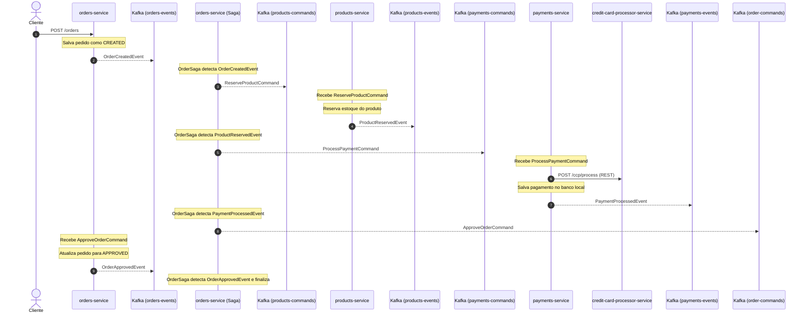
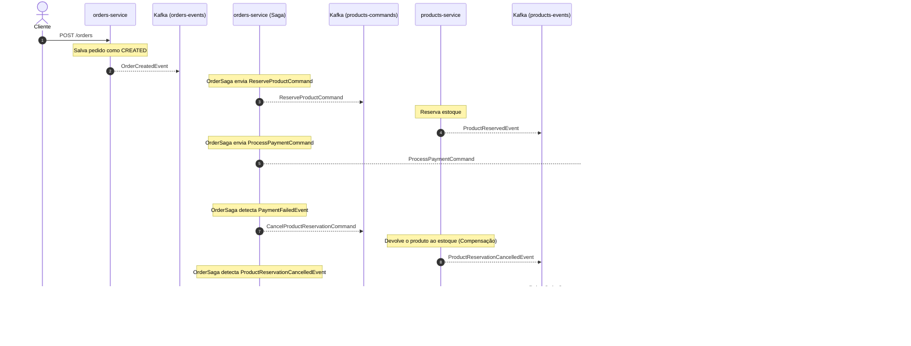
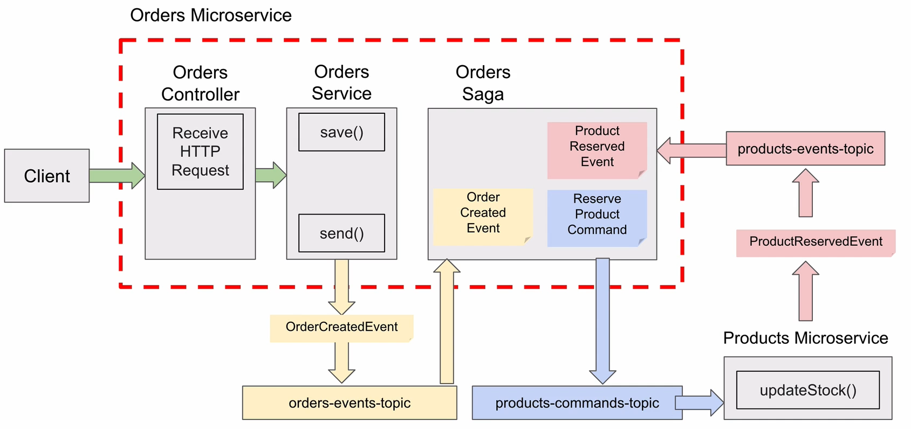

# Saga Orchestration Pattern com Spring Boot e Apache Kafka

Este repositório é um projeto de estudo prático para explorar a implementação do **Padrão Saga Baseado em Orquestração** (Saga Orchestration Pattern) utilizando o ecossistema do **Spring Boot** e **Apache Kafka** como mensageria assíncrona.

---

## 📖 O Padrão Saga

Em arquiteturas de microsserviços, garantir a consistência dos dados entre múltiplos serviços sem o uso de transações distribuídas (que prejudicam o desempenho e a escalabilidade) é um grande desafio. O **Padrão Saga** resolve isso dividindo uma transação de negócios em uma série de transações locais em cada microsserviço.

Neste repositório, foi adotada a abordagem de **Orquestração**:
- O `orders-service` atua como o **Orquestrador da Saga** (`OrderSaga.java`).
- Ele escuta eventos publicados nos tópicos do Kafka e envia comandos de ação correspondentes para os outros microsserviços.
- Se uma das etapas falhar, o orquestrador coordena a execução de **transações compensatórias** (rollback lógico) para desfazer os passos anteriores e restaurar a consistência dos dados.

---

## 🏗️ Arquitetura do Projeto

O projeto é estruturado como um monorepo Maven composto pelos seguintes módulos:

1. **`core`**
   - Biblioteca compartilhada que define os modelos comuns, DTOs de comandos e eventos (ex: `OrderCreatedEvent`, `ReserveProductCommand`), enums (`OrderStatus`) e exceções customizadas.
2. **`orders-service`** (Porta `8080`)
   - Responsável pela criação de pedidos. Contém a lógica do Orquestrador (`OrderSaga.java`) e mantém a tabela de histórico de execução da saga.
3. **`products-service`** (Porta `8081`)
   - Gerencia o estoque de produtos, processa a reserva de itens para novos pedidos e realiza o cancelamento da reserva (reposição de estoque) em caso de rollback.
4. **`payments-service`** (Porta `8082`)
   - Responsável pelo processamento de pagamentos. Integra-se via REST HTTP com o serviço externo de validação de cartões.
5. **`credit-card-processor-service`** (Porta `8084`)
   - Um serviço mock que simula um gateway de pagamento (adquirente).

### 🏷️ Tópicos do Kafka Configurados
- `orders-events`: Eventos relacionados ao ciclo de vida do pedido.
- `order-commands`: Comandos enviados para o serviço de pedidos.
- `products-commands`: Comandos enviados para o serviço de produtos.
- `products-events`: Eventos relacionados a estoque e produtos.
- `payments-commands`: Comandos enviados para o serviço de pagamentos.
- `payments-events`: Eventos relacionados a pagamentos.

---

## 🔄 Fluxos da Saga

### 1. Caminho Feliz (Sucesso Completo)
No caso em que todos os passos ocorrem com sucesso, o fluxo de comunicação segue a sequência abaixo:



### 2. Fluxo de Compensação (Rollback) por Falha de Pagamento
Se o processamento do pagamento falhar (por exemplo, se o `credit-card-processor-service` estiver indisponível ou retornar erro), a transação é desfeita de forma reversa (compensação):



> [!NOTE]
> **Limitações conhecidas para estudo:**
> O evento `ProductReservationFailedEvent` (disparado quando o produto não possui estoque suficiente no `products-service`) é publicado no tópico `products-events`, mas atualmente o `OrderSaga` não implementa o método `@KafkaHandler` para tratá-lo. Em um cenário real de produção, o orquestrador escutaria este evento e dispararia imediatamente um `RejectOrderCommand` para o `orders-service` marcar o pedido como `REJECTED`.

---

## 🛠️ Tecnologias Utilizadas

- **Java 17**
- **Spring Boot 3.5.x**
- **Apache Kafka** (Cluster com 3 brokers configurado via KRaft)
- **Spring Kafka** (Integração assíncrona baseada em eventos/comandos)
- **H2 Database** (Persistência local relacional em memória para fins de estudo)
- **Spring Data JPA**
- **Docker & Docker Compose** (Para subir o cluster Kafka localmente)

---

## 🚀 Como Executar o Projeto

### Pré-requisitos
- JDK 17 ou superior
- Maven 3.x
- Docker e Docker Compose

### Passo 1: Subir o Cluster Apache Kafka
No diretório raiz do projeto (onde está o arquivo `docker-compose.yml`), execute o comando abaixo para iniciar o cluster Kafka com 3 brokers:
```bash
docker-compose up -d
```
Certifique-se de que os containers `kafka-1`, `kafka-2` e `kafka-3` estejam ativos e saudáveis.

### Passo 2: Compilar e Instalar o Módulo `core`
Como o módulo `core` é uma biblioteca local que contém DTOs compartilhados, e não está listado no bloco de `<modules>` no `pom.xml` pai, você precisa compilá-lo e instalá-lo no repositório Maven local antes dos outros serviços:
```bash
mvn clean install -f core/pom.xml
```

### Passo 3: Compilar o Restante dos Microsserviços
A partir da raiz do projeto, execute a build geral:
```bash
mvn clean install
```

### Passo 4: Inicializar as Aplicações
Execute cada microsserviço em terminais separados utilizando o plugin do Spring Boot.

1. **Credit Card Processor (Mock Gateway)**:
   ```bash
   mvn spring-boot:run -pl credit-card-processor-service
   ```
2. **Products Service**:
   ```bash
   mvn spring-boot:run -pl products-service
   ```
3. **Payments Service**:
   ```bash
   mvn spring-boot:run -pl payments-service
   ```
4. **Orders Service (Orquestrador)**:
   ```bash
   mvn spring-boot:run -pl orders-service
   ```

---

## 🧪 Como Testar o Fluxo Prático

Você pode utilizar ferramentas como `curl`, Postman ou Insomnia para disparar as requisições HTTP abaixo.

### 1. Cadastrar um Produto
Para iniciar o fluxo de pedidos, é necessário ter produtos em estoque. Faça uma requisição para o `products-service`:

**Requisição:**
```bash
curl -X POST http://localhost:8081/products \
  -H "Content-Type: application/json" \
  -d '{
    "name": "Monitor Gamer UltraWide",
    "price": 1200.00,
    "quantity": 15
  }'
```

**Resposta esperada (guarde o `id` gerado):**
```json
{
  "id": "270f2095-234b-4f40-84a9-a682db14f32c",
  "name": "Monitor Gamer UltraWide",
  "price": 1200.00,
  "quantity": 15
}
```

### 2. Simular Fluxo de Sucesso (Caminho Feliz)
Crie um pedido chamando o `orders-service` com o `productId` retornado na etapa anterior:

**Requisição:**
```bash
curl -X POST http://localhost:8080/orders \
  -H "Content-Type: application/json" \
  -d '{
    "customerId": "6f2e811c-d762-4217-91a9-b903cf44520e",
    "productId": "270f2095-234b-4f40-84a9-a682db14f32c",
    "productQuantity": 2
  }'
```

**Acompanhar a Saga:**
Após criar o pedido com sucesso, consulte o histórico de transições da saga passando o `id` do pedido retornado no corpo da resposta:
```bash
curl http://localhost:8080/orders/{orderId}/history
```

**Resposta esperada:**
Deverá listar as etapas do processamento indicando a transição de `CREATED` até a aprovação final `APPROVED`.

### 3. Simular Compensação (Rollback) por Falha de Pagamento
Para testar a transação compensatória:
1. Pare a execução do serviço `credit-card-processor-service` (pressione `Ctrl+C` no terminal dele).
2. Envie uma nova requisição de pedido (`POST http://localhost:8080/orders`).
3. Consulte o histórico do pedido (`GET http://localhost:8080/orders/{orderId}/history`).

**Resultado:**
O pedido começará como `CREATED`, tentará processar o pagamento, falhará por indisponibilidade do processador (restTemplate lançará `ResourceAccessException`), e a saga executará a compensação enviando o comando para repor o estoque no `products-service` antes de finalmente marcar o pedido como `REJECTED`.

---

## 🛢️ Console H2 (Bancos de Dados Locais)
Você pode inspecionar o estado dos dados em tempo real acessando os consoles H2 de cada microsserviço:
- **Orders Service Database**: [http://localhost:8080/h2-console](http://localhost:8080/h2-console)
- **Products Service Database**: [http://localhost:8081/h2-console](http://localhost:8081/h2-console)
- **Payments Service Database**: [http://localhost:8082/h2-console](http://localhost:8082/h2-console)

**Credenciais de Acesso:**
- **JDBC URL**: `jdbc:h2:mem:testdb`
- **User**: `sa`
- **Password**: `password`

---

*Diagrama ilustrativo do projeto:*

