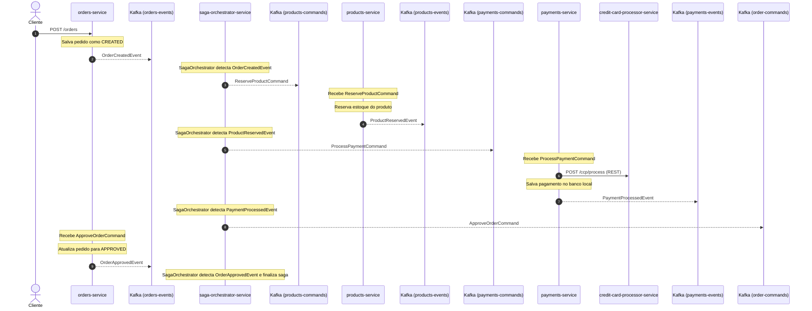
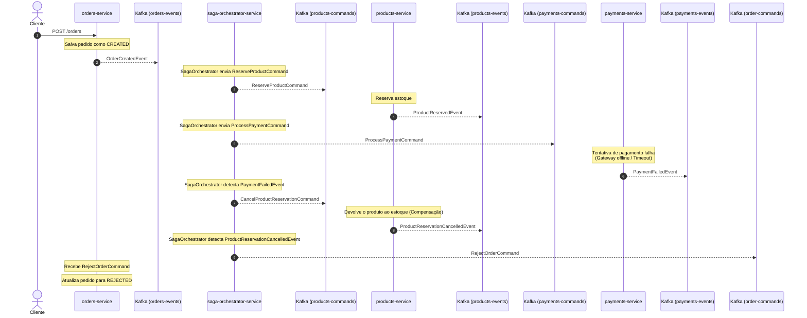
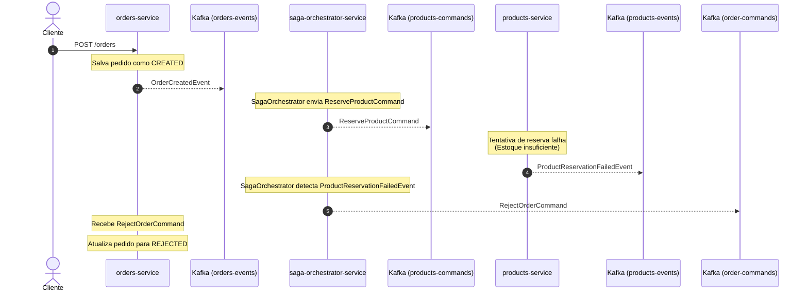

# Saga Orchestration Pattern com Spring Boot e Apache Kafka

Este repositório é um projeto de estudo prático para explorar a implementação do **Padrão Saga Baseado em Orquestração** (Saga Orchestration Pattern) utilizando o ecossistema do **Spring Boot** e **Apache Kafka** como mensageria assíncrona.

## Desenho da Arquitetura

---


## 📖 O Padrão Saga

Em arquiteturas de microsserviços, garantir a consistência dos dados entre múltiplos serviços sem o uso de transações distribuídas (que prejudicam o desempenho e a escalabilidade) é um grande desafio. O **Padrão Saga** resolve isso dividindo uma transação de negócios em uma série de transações locais em cada microsserviço.

Neste repositório, foi adotada a abordagem de **Orquestração**:
- O `saga-orchestrator-service` atua exclusivamente como o **Orquestrador da Saga** (`SagaOrchestrator.java`).
- Ele escuta eventos publicados nos tópicos do Kafka e envia comandos de ação correspondentes para os outros microsserviços.
- Se uma das etapas falhar, o orquestrador coordena a execução de **transações compensatórias** (rollback lógico) para desfazer os passos anteriores e restaurar a consistência dos dados.

---

## 🏗️ Arquitetura do Projeto

O projeto é estruturado como um monorepo Maven composto pelos seguintes módulos:

1. **`core`**
   - Biblioteca compartilhada que define os modelos comuns, DTOs de comandos e eventos (ex: `OrderCreatedEvent`, `ReserveProductCommand`), enums (`OrderStatus`) e exceções customizadas.
2. **`orders-service`** (Porta `8080`)
   - Responsável pela criação e manutenção de pedidos e mantém a tabela de histórico de execução.
3. **`saga-orchestrator-service`** (Porta `8083`)
   - Serviço dedicado exclusivamente a orquestrar o fluxo do padrão Saga (`SagaOrchestrator.java`).
4. **`products-service`** (Porta `8081`)
   - Gerencia o estoque de produtos, processa a reserva de itens para novos pedidos e realiza o cancelamento da reserva (reposição de estoque) em caso de rollback.
5. **`payments-service`** (Porta `8082`)
   - Responsável pelo processamento de pagamentos. Integra-se via REST HTTP com o serviço externo de validação de cartões.
6. **`credit-card-processor-service`** (Porta `8084`)
   - Um serviço mock que simula um gateway de pagamento (adquirente).

### 🏷️ Tópicos do Kafka Configurados
- `orders-events`: Eventos relacionados ao ciclo de vida do pedido.
- `order-commands`: Comandos enviados para o serviço de pedidos.
- `products-commands`: Comandos enviados para o serviço de produtos.
- `products-events`: Eventos relacionados a estoque e produtos.
- `payments-commands`: Comandos enviados para o serviço de pagamentos.
- `payments-events`: Eventos relacionados a pagamentos.

---

## 📐 Padrões de Arquitetura Implementados (Design Patterns)

Esta aplicação utiliza um conjunto de padrões de arquitetura para sistemas distribuídos e microsserviços para garantir alta disponibilidade, consistência de dados, rastreabilidade e resiliência:

### 1. 🎼 Saga Orchestration Pattern (Orquestração de Sagas)
- **O que é**: Divide transações de negócios distribuídas em passos locais executados por diferentes microsserviços sob o comando de um coordenador centralizado.
- **Como está implementado**: O serviço `saga-orchestrator-service` possui a classe `SagaOrchestrator.java`, que escuta eventos nos tópicos do Kafka e toma decisões sobre qual próximo comando enviar (ex: enviar `ReserveProductCommand` ao receber `OrderCreatedEvent`). Em caso de falhas em qualquer ponto da cadeia, o orquestrador coordena o disparo das ações compensatórias.

### 2. 📦 Transactional Outbox Pattern (Outbox Transacional)
- **O que é**: Evita o problema de **Dual Write** (escrever no banco de dados e enviar mensagem para o Kafka na mesma requisição, arriscando inconsistências se a rede ou o broker falharem).
- **Como está implementado**: Descentralizado em cada microsserviço (`orders-service`, `products-service`, `payments-service` e `saga-orchestrator-service`). Durante a mesma transação `@Transactional` que altera os dados de negócio, a mensagem a ser enviada ao Kafka é salva na tabela local `outbox` com o status `PENDING`. Um poller assíncrono `@Scheduled` (`OutboxPublisherScheduler`) lê os registros pendentes, envia para o Kafka e atualiza o status para `PROCESSED`. Um segundo agendador (`OutboxCleanerScheduler`) purga registros processados antigos após 7 dias.

### 3. 🔄 Compensating Transaction Pattern (Transação Compensatória)
- **O que é**: Como transações ACID distribuídas (2PC) não são utilizadas em microsserviços de alta performance, este padrão desfaz logicamente os efeitos de transações anteriores caso uma etapa posterior da saga falhe.
- **Como está implementado**: Se o pagamento falhar no `payments-service`, o `SagaOrchestrator` publica o comando `CancelProductReservationCommand` no tópico `products-commands`. O `products-service` escuta o comando e devolve a quantidade reservada de volta ao estoque do produto. Em seguida, envia `RejectOrderCommand` para alterar o estado do pedido no `orders-service` para `REJECTED`.

### 4. 🔍 Distributed Tracing & W3C Context Propagation Pattern (Propagação de Contexto)
- **O que é**: Mantém a continuidade da árvore de Spans em sistemas assíncronos e orientados a eventos, permitindo visualizar a jornada completa da requisição no **Grafana Tempo**.
- **Como está implementado**:
  - **No momento do salvamento do Outbox**: O `OutboxServiceImpl` captura o cabeçalho W3C `traceparent` ativo da requisição usando OpenTelemetry API (`Context.current()`) e salva na coluna `trace_parent` da tabela `outbox`.
  - **No envio ao Kafka**: O `OutboxPublisherScheduler` extrai a string `traceParent`, reconstrói o contexto pai, cria um Span de publicação (`outbox_publish`) e injeta a chave `traceparent` nos `Record Headers` do Kafka.
  - **No consumo**: Os listeners do Kafka extraem o `traceparent` dos cabeçalhos das mensagens e mantêm o trace distribuído unificado e sem quebras no Grafana.

### 5. 🗄️ Database per Service Pattern (Banco de Dados por Serviço)
- **O que é**: Garante o acoplamento fraco e a autonomia de cada microsserviço, que mantém seu próprio banco de dados privado inacessível por outros serviços.
- **Como está implementado**: Cada microsserviço possui seu próprio banco de dados H2 isolado em memória (`jdbc:h2:mem:testdb`), acessível unicamente pelo próprio serviço. A comunicação entre serviços é feita exclusivamente via mensagens assíncronas no Kafka ou chamadas de API (como a integração REST HTTP do `payments-service` com o `credit-card-processor-service`).

---


---

## 🔄 Fluxos da Saga

### 1. Caminho Feliz (Sucesso Completo)
No caso em que todos os passos ocorrem com sucesso, o fluxo de comunicação orquestrado pelo `saga-orchestrator-service` segue a sequência abaixo:



### 2. Fluxo de Compensação (Rollback) por Falha de Pagamento
Se o processamento do pagamento falhar (por exemplo, se o `credit-card-processor-service` estiver indisponível ou retornar erro), a transação é desfeita de forma reversa (compensação) sob coordenação do `saga-orchestrator-service`:



### 3. Fluxo de Rejeição por Falha na Reserva de Produto (Estoque Insuficiente)
Se a reserva de estoque no `products-service` falhar (por exemplo, quantidade insuficiente em estoque ou erro na validação), o `saga-orchestrator-service` capta o evento de falha e coordena o cancelamento direto do pedido:



---

## 🛠️ Tecnologias Utilizadas

- **Java 17**
- **Spring Boot 4.1.0**
- **Apache Kafka** (Cluster com 3 brokers configurado via KRaft)
- **Spring Kafka** (Integração assíncrona baseada em eventos/comandos)
- **H2 Database** (Persistência local relacional em memória para fins de estudo)
- **Spring Data JPA**
- **Docker & Docker Compose** (Para subir o cluster Kafka e Grafana LGTM localmente)
- **Observabilidade**: OpenTelemetry Collector, Grafana LGTM(Loki, Grafana, Tempo, Mimir)

---

## 🚀 Como Executar o Projeto

### Pré-requisitos
- JDK 17 ou superior
- Maven 3.x
- Docker e Docker Compose

### Passo 1: Subir o Cluster Apache Kafka
No diretório raiz do projeto (onde está o arquivo `docker-compose.yml`), execute o comando abaixo para iniciar o cluster Kafka com 3 brokers:
```bash
docker-compose up -d
```
Certifique-se de que os containers `kafka-1`, `kafka-2` e `kafka-3` estejam ativos e saudáveis.

### Passo 2: Compilar e Instalar os Módulos
A partir da raiz do projeto, execute o comando abaixo para compilar e rodar os testes de todos os 7 módulos do reator Maven (incluindo `core`):
```bash
mvn clean install
```


### Passo 4: Inicializar as Aplicações
Execute cada microsserviço em terminais separados utilizando o plugin do Spring Boot.

1. **Credit Card Processor (Mock Gateway)**:
   ```bash
   mvn spring-boot:run -pl credit-card-processor-service
   ```
2. **Products Service**:
   ```bash
   mvn spring-boot:run -pl products-service
   ```
3. **Payments Service**:
   ```bash
   mvn spring-boot:run -pl payments-service
   ```
4. **Saga Orchestrator Service**:
   ```bash
   mvn spring-boot:run -pl saga-orchestrator-service
   ```
5. **Orders Service**:
   ```bash
   mvn spring-boot:run -pl orders-service
   ```

---

## 🧪 Como Testar o Fluxo Prático

Você pode utilizar ferramentas como `curl`, Postman ou Insomnia para disparar as requisições HTTP abaixo.

### 1. Cadastrar um Produto
Para iniciar o fluxo de pedidos, é necessário ter produtos em estoque. Faça uma requisição para o `products-service`:

**Requisição:**
```bash
curl -X POST http://localhost:8081/products \
  -H "Content-Type: application/json" \
  -d '{
    "name": "Monitor Gamer UltraWide",
    "price": 1200.00,
    "quantity": 15
  }'
```

**Resposta esperada (guarde o `id` gerado):**
```json
{
  "id": "270f2095-234b-4f40-84a9-a682db14f32c",
  "name": "Monitor Gamer UltraWide",
  "price": 1200.00,
  "quantity": 15
}
```

### 2. Simular Fluxo de Sucesso (Caminho Feliz)
Crie um pedido chamando o `orders-service` com o `productId` retornado na etapa anterior:

**Requisição:**
```bash
curl -X POST http://localhost:8080/orders \
  -H "Content-Type: application/json" \
  -d '{
    "customerId": "6f2e811c-d762-4217-91a9-b903cf44520e",
    "productId": "270f2095-234b-4f40-84a9-a682db14f32c",
    "productQuantity": 2
  }'
```

**Acompanhar a Saga:**
Após criar o pedido com sucesso, consulte o histórico de transições da saga passando o `id` do pedido retornado no corpo da resposta:
```bash
curl http://localhost:8080/orders/{orderId}/history
```

**Resposta esperada:**
Deverá listar as etapas do processamento indicando a transição de `CREATED` até a aprovação final `APPROVED`.

### 3. Simular Compensação (Rollback) por Falha de Pagamento
Para testar a transação compensatória:
1. Pare a execução do serviço `credit-card-processor-service` (pressione `Ctrl+C` no terminal dele).
2. Envie uma nova requisição de pedido (`POST http://localhost:8080/orders`).
3. Consulte o histórico do pedido (`GET http://localhost:8080/orders/{orderId}/history`).

**Resultado:**
O pedido começará como `CREATED`, tentará processar o pagamento, falhará por indisponibilidade do processador (restTemplate lançará `ResourceAccessException`), e a saga executará a compensação enviando o comando para repor o estoque no `products-service` antes de finalmente marcar o pedido como `REJECTED`.

---

## 🛢️ Console H2 (Bancos de Dados Locais & Tabela Outbox)
Você pode inspecionar a tabela de negócios e a tabela `outbox` em tempo real acessando os consoles H2 de cada microsserviço:
- **Orders Service Database**: [http://localhost:8080/h2-console](http://localhost:8080/h2-console)
- **Products Service Database**: [http://localhost:8081/h2-console](http://localhost:8081/h2-console)
- **Payments Service Database**: [http://localhost:8082/h2-console](http://localhost:8082/h2-console)
- **Saga Orchestrator Service Database**: [http://localhost:8083/h2-console](http://localhost:8083/h2-console)

**Credenciais de Acesso:**
- **JDBC URL**: `jdbc:h2:mem:testdb`
- **User**: `sa`
- **Password**: `password`

